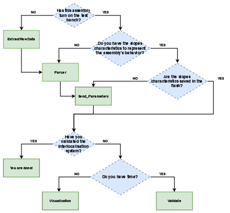
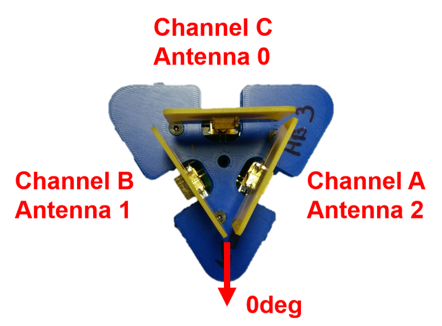
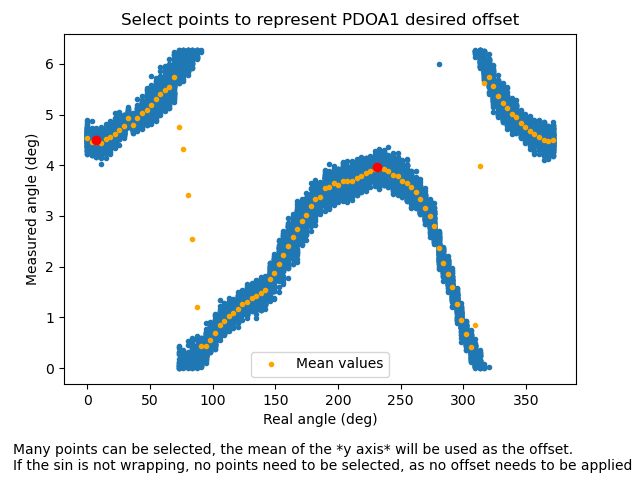
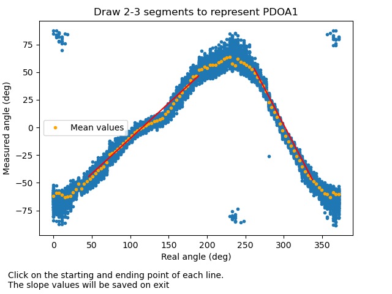
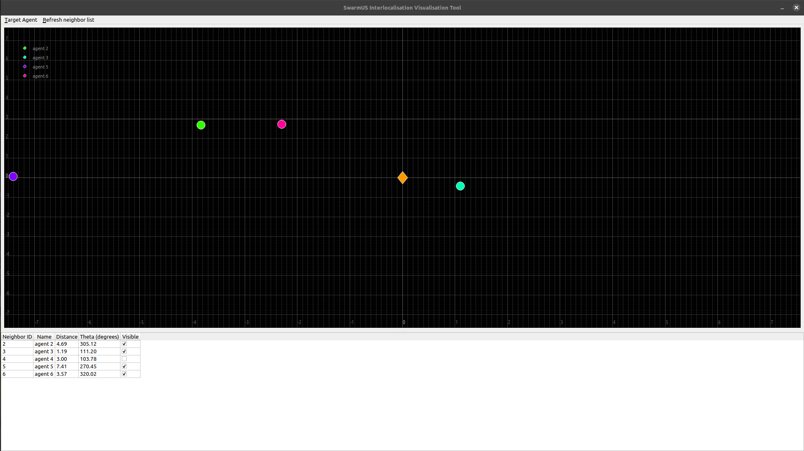

# TestBench-Python
This repo is the accumulation of many scripts needed in order to calibrate and validate a new set of Beeboard and Hiveboard.
The python scripts are :
- [ExtractRawData](#extractRawData)
- [Parser](#parser)
- [Send_angle_params](#send_angle_params)
- [Visualization](#visualization)
- [Validate](#validate)
	
## Installation
Prerequisites:

- [Python 3.x](https://www.python.org/downloads/)
- [Pip](https://pypi.org/project/pip/)

Each script has its own requirements.txt which permits the installation of the required packages
## Normal order of operation
Follow this flow chart in order to find which script to run depending on your need:
<br />
## ExtractRawData
This script enables the user to extract the raw DW1000 data from the HiveBoard/BeeBoards assembly. The test-bench will turn by a chosen stepping angle and acquire the desired amount of raw data per step.
#### Hardware setup
- Place a BeeBoards assembly in the middle of the test-bench. The 0deg axis of the assembly needs to point in a parallel fashion to the mounted laser pointer. 
	- The **assembly** is described as :
		- The BeeBoard mount
		- The 3 wings boards
		- The 3 USC-C cables
		- The HiveBoard
		- The channel used for each BeeBoard.
- The BeeBoards have to be connected to a HiveBoard mounted to the test-bench using the same cable and ports as labeled on the assembly. If the cables and assembly are not indicated be sure to note which BeeBoards are used, plugged with which cables and in which channel on which HiveBoard. **The calibration will only be valid for this configuration and has to be completly re-performed if any of this component is changed or plugged differently.**
- The BeeBoard assembly should be mounted as follow:<br />
**If, for any reason, the antenna are not plugged in the same channel as asked per the hardware setup, absolutely refer to the [angle documentation](https://swarmus.github.io/SwarmUS-doc/sections/reference/Interloc/how_it_works/angle/) as everything is dependent on this.**
<br />
- Connect power and communication interface to the HiveBoard.
- Ensure the HiveBoard has the latest version of the [HiveMind](https://github.com/SwarmUS/HiveMind)
- Connect a usb cable to the Arduino.
- Connect power to the drive submodule (red = 12&nbsp;V, white = ground)
- To align the receiver with the emmiter, use the laser pointer. Each laser should point to the alignment target of the other laser assembly. This position ensures a 0 degree relative orientation between the two radio setup. 
- The laser mount should be calibrated periodicly to ensure its position and accuracy.
- Press button 0 on the emmiter to enable the continuous sending mode.
- Ensure that nothing is between the emmiter and the BeeBoard assembly (ensure line of sight).
#### Runnning the script
The script can be run from `/src/extractRawData`.<br />
Requires the [TestBench-Arduino](https://swarmus.github.io/SwarmUS-doc/) code to be installed on the test-bench's Arduino in order to be interfaced.

#### Adjustable parameters
`USE_ETHERNET` : If `True`, the communication with the Hiveboard will be done from the Ethernet port. If `False`, the UART interface will be used, and the following line must be edited to match the port on which the Hiveboard is connected.
```python
hb_stream = UsbStream('COM16')
```
The Arduino communicates through UART and the following line must be edited: 
```python
testbench = TurningStation('COM15', 115200)
```
`name` : suffix given to the produced CSV with the raw data.<br />
`stepSize` : number of encoder ticks between each acquisition position.<br />
`num_frames` : number of raw data frames to be acquisitioned at each position.<br />
`destination` : ending position of the acquisition. The used encoder has 2048 tick per turn, 2050 should represent a single complete turn.<br />
The data extracted will be saved upon completion of the acquisition once the destination has been reached. The saved data is found in the `/src/data` folder. Each CSV is timestamped and named using the `name` variable.

Once these parameters have been adjusted, the file can be run. The *TurningStation* should turn the amount entered in `step` and then stop for 3-5 seconds for the acquisition period before starting to turn again, repeting this cycle until `destination` has been reached. A complete turn takes usually around 15 minutes.

#### Note
Communication with the HiveBoard is done using the [Pheromones submodule](https://github.com/SwarmUS/Pheromones). If communication problems occur, ensure that the version used by the script is the same as on the HiveBoard.
## Parser
Parses and presents the PDOA values from the previously acquired raw data (from [ExtractRawData](#pxtractRawData)). The user will be prompted 2 clickable interfaces to firstly offset the data to a common reference and secondly to extract the slopes of each antenna pair.
#### Runnning the script
The script can be run from `src/parser`.
#### Adjustable parameters
`dataFolderPath` : folder path where the extracted raw data CSV produced by [ExtractRawData](#pxtractRawData) has been saved.<br />
`dataName` : name of the file to parse the data from, without the extension.<br />
`usedPairs` : the antenna pairs to be used. Use 0,1 and 5 for default operation. Encoded as follow :<br />
<pre><code>	pair 0 = antenna 0 - antenna 1<br />
	pair 1 = antenna 0 - antenna 2<br />
	pair 2 = antenna 1 - antenna 0<br />
	pair 3 = antenna 1 - antenna 2<br />
	pair 4 = antenna 2 - antenna 0<br />
	pair 5 = antenna 2 - antenna 1<br /></code></pre>
	Refer to the [angle documentation](https://swarmus.github.io/SwarmUS-doc/sections/reference/Interloc/how_it_works/angle/) for a better understanding of the antenna pairs and their selection. <br />
`EXPORT_PDOA` : `True` will prompt the second set of plots (slopes extraction) and save the calibration result in a **pickle** format.
#### Behavioral descriptionand user interaction
Upon runnning the script, the first plot to appear will ask the user to select points from which to offset the whole dataset. Theoretically, the plot should represent a **sin** wave. The goal is to offset the signal until it wraps minimally. If the **sin** is not wrapping, no points need to be selected, as no offset needs to be applied, simply close the plot. Otherwise, the points selected should then be the very bottom of a **sin** *parabola* section.  Also, to obtain a better estimation of the offset needed, it is possible to select the very bottom of the *parabola*, and a top of this *parabola* that has wrapped over. Many points can be selected, the mean of the *y axis* will be used as the offset. This process has to be repeted for the number of `usedPairs` selected. Here is an exemple of the process.<br />
<br />
A plot of the result will then appear. If all curves are not wrapping, the first step is succesful. Otherwise, the script must be re-run and better points must be selected until all curves do not wrap. <br />

The second set of plots is the extraction of the slopes caracteristics. This set will appear only if the `EXPORT_PDOA` has beed set to `True`. A minimum of two lines, and a maximum of three, must be drawn in order to represent the slopes of the data. To draw a line, clic on two points, preferably the farthest appart. Draw at least one line for the rising part and one line for the falling part. This process has to be repeted for the number of `usedPairs` selected. Here is an exemple of the process.<br />
<br />
The saved data will appear in the `dataFolderPath/angleParameters`. Each antenna pair has its own pickle file. These files will also be refered as the **calibration**.
A validation of these files can be done using the `testRead` function from the `Exporter` class.<br />

## Send_angle_params
Communicates to the Hiveboard the slope and caracteristics of the antenna pairs. Uses the pickle files created by [Parser](#parser). These files need to be placed in the calibration folder using the `hb_{HIVEBOARD_ID}` notation.<br />
#### Runnning the script
The script can be run from `/src/send_angle_params`.
#### Adjustable parameters
`HIVEBOARD_ID` : the identification number of the Hiveboard. Can be found either in the flash memory or written on the RJ45 connector. <br />
`MOUNT_ORIENTATION_OFFSET` : the rotation offest, in degrees, applied to the Beeboard assembly between the Test-bench setup at which the calibration was made, and the orientation on the robot or final installation.<br />
`USE_ETHERNET` : If true, the communication with the Hiveboard will be done from the Ethernet port. If false, the UART interface will be used, and the following line must be adjusted to match the port on which the Hiveboard is connected.
```python
hb_stream = UsbStream('COM16')
```
#### Behavioral description
When the script is ran, the parameters in the calibration folder will be sent to the connected Hiveboard and saved in the flash memory. Thus, there is no need to re-send the parameters on every boot cycle. **The calibration should be performed occasionally to ensure the system reliability.**

#### Note
Communication with the HiveBoard is done using the [Pheromones submodule](https://github.com/SwarmUS/Pheromones). If communication problems occur, ensure that the version used by the script is the same as on the HiveBoard.
## Visualization
When a calibration has been completly transfered to the correspondant Hiveboard, this tool can be used to manually and visually confirm the effectiveness of the calibration. Using a emmiter, the user can move around the calibrated Hiveboard/BeeBoards assembly and see a marker representing the emmiter move around.

To use the tool, you will need one stationary HiveBoard with its BeeBoards and at least one mobile
HiveBoard/BeeBoard assembly.

The stationary HiveBoard must be powered by the barrel connector (**not** by USB). Plug the Micro-USB cable to your 
computer for the serial connection.

Next, start the mobile HiveBoard/BeeBoards assembly.

To start the tool, start `src/visualisation_tool`. By default, the visualization tool will
use the com port `/dev/ttyACM0`. To edit this value, edit the `COM_PORT` variable in `DataUpdater.py`.

The visualization tool will open a window with an orange dot at the center, representing the stationary HiveBoard. The 
mobile HiveBoard assemblies will show as coloured circles and their position will be updated at regular intervals. Specific
neighbors can be hidden by unchecking the 'visible' check box in the table underneath the graph.



#### Note
Communication with the HiveBoard is done using the [Pheromones submodule](https://github.com/SwarmUS/Pheromones). If communication problems occur, ensure that the version used by the script is the same as on the HiveBoard.
## Validate
This is a method to test the whole angles system of the interlocalisation. Using the exact same hardware setup as the calibration it is possible to extract the angle value result from the whole acquisition, linearisation and certitude algorithm. Using the test-bench assembly will automate this procedure.
#### Runnning the script
The script can be run from `src/validate_interloc`.<br />
Requires the [TestBench-Arduino](https://swarmus.github.io/SwarmUS-doc/) code to be installed on the test-bench's Arduino in order to be interfaced.
#### Hardware setup
Refer to the [ExtractRawData](#extractRawData) hardware setup section for the protocol to ensure precise data acquisition.
#### Adjustable parameters
`REMOTE_HB_ID`: ID of the emmiter used for the validation. As many HiveBoard can be detected, the scripts filters only the one needed by the user.<br />
`NUM_DATA_POINTS_PER_ANGLE`:number of cycles to do  at each angle position. Each cycles output a single angle value.<br />
`USE_ETHERNET` : If `True`, the communication with the Hiveboard will be done from the Ethernet port. If `False`, the UART interface will be used, and the following line must be edited to match the port on which the Hiveboard is connected.
```python
hb_stream = UsbStream('/dev/ttyACM0')
```
The Arduino communicates through UART and the following line must be edited: 
```python
testbench = TurningStation('/dev/ttyACM1', 115200)
```
`stepSize` : number of encoder ticks between each acquisition position.<br />
`destination` : ending position of the acquisition. The used encoder has 2048 tick per turn, 2050 should represent a single complete turn.<br />
The data extracted will be saved upon completion of the acquisition once the destination has been reached.

#### Behavioral description
Similarly to [ExtractRawData](#extractRawData), the *TurningStation* will turn by the `stepSize` incrementation until it reaches the `destination` encoder tick. At each increment, the interlocalisation is enabled and produces `NUM_DATA_POINTS_PER_ANGLE` angles. These values are the one that would be propagated in the system in a typical use case. For a complete description of the process behind these values, please refer to Swarmus official [interlocalisation documentation]( https://swarmus.github.io/SwarmUS-doc/sections/reference/Interloc/how_it_works/intro/).

#### Results
 The saved data is found in the `/src/data` folder. Each CSV is timestamped and named using the "validation_" prefix. For a visual analysis of the data, 3 plots have already been created. Running `src/analysis/analyze_interloc_validation` will produce:
 - A representation of the acquired angles for each position.
 - The error between the calculated angle and the actual orientation of the emmiter.
 - The standard deviation of the angles calculated at each position.<br />
 To select which file to analyze, edit :
```python
analyze_validation("../data/validation_hb6.csv")
```
#### Note
Communication with the HiveBoard is done using the [Pheromones submodule](https://github.com/SwarmUS/Pheromones). If communication problems occur, ensure that the version used by the script is the same as on the HiveBoard.
